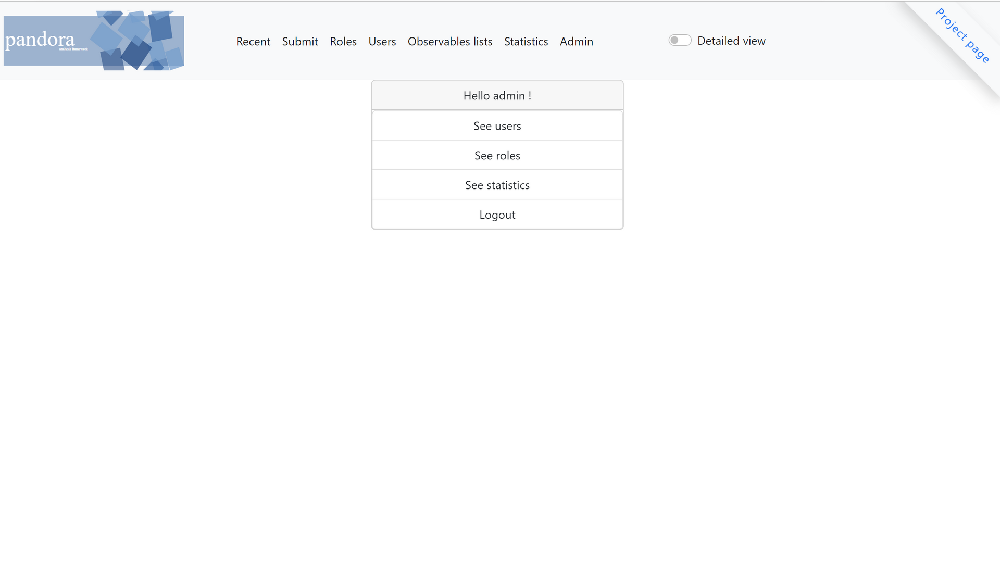
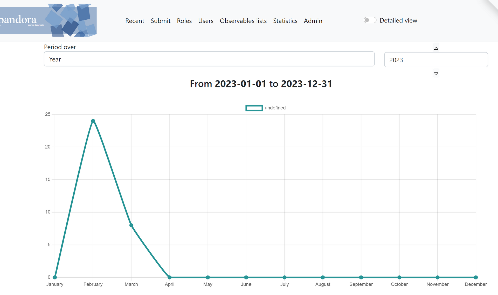

# Administration Guide

## Web Interface console

the administration console is: [http://pandora/admin](http://pandora/admin)



### Users admins

in generic.conf , add users in the keys users

```json
users:{"admin1":"password1", 

  "admin2":"password2"}
```

after adding users, restart pandora

```bash
sudo services pandora restart
```

## Statistics and reports

in generic.json you can setup a delay index for the reports in the *Recent* menu

the key is by default is 3 day

```json
max_delay_index: 3
```

you have access at the statistics submission in *Statistics* menu.



## setup email

in generic.json, you can setup for receiving emails for specific reports.

```json
"email": {
        "smtp_host": "localhost",
        "smtp_port": "25",
        "to": ["Investigation Team <investigation_unit@myorg.local>"],
        "from": "Pandora <pandora@myorg.local>"
    },
    "email_smtp_auth": {
        "auth": false,
        "smtp_user":"johndoe@myorg.local",
        "smtp_pass":"password",
        "smtp_use_tls": false
    }
```

The key *email* is for smtp configuration and the email contacts.

if you have to use authentification and TLS, you'll have to setup *email_smtp_auth* dict.

choose *true* for authentification for the key *auth*
and setup user, passwords for the keys *smtp_user* and *smtp_pass*

For TLS, choose *true*  for the key *smtp_use_tls*
